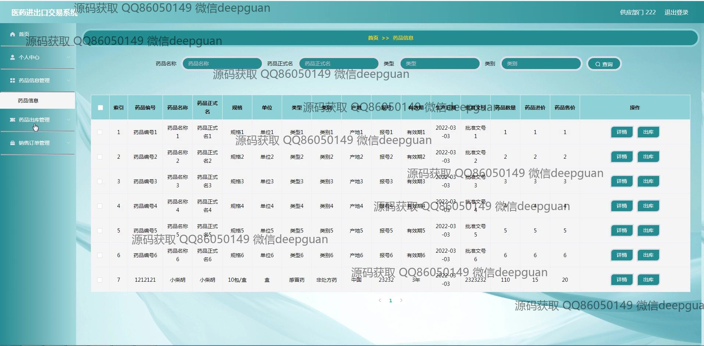

<h1 align="center">医药进出口交易系统</h1>

## 简介
医药进出口交易系统：角色分为管理员、仓储、供应、业务、客户和财务；主要功能包括药品和订单管理、客户和供应商管理、员工信息管理及登录权限控制。    --计算机毕业设计源码；毕设源码；java毕业设计源码

## 联系方式

<h3 align="center">获取完整代码与数据库文件 + 微信：deepguan QQ: 86050149 QQ群: 783742310</h3>

<h3 align="center">可帮忙远程部署 包运行成功！提供远程部署、修改代码、设计文档指导、代码讲解等服务！</h3>

## 功能介绍（完整见运行截图）
管理员：基本功能包括登录、注册、和退出。可以通过网站首页主导航栏访问各个模块，包括个人中心、采购订单管理、销售订单管理、财务部管理、以及客户订单和退货订单管理等。管理员可以管理和录入药品信息，如药品编号、名称、规格、产地等，还能查看和修改仓储、供应、业务、以及员工信息。订单管理功能涉及采购编号、商品名称、药品售价及客户信息的填写和修改。通过左侧导航菜单，管理员可以轻松访问药品库存以及过期药品管理功能。

仓储部门：登录后可以管理和录入药品信息，包括药品的入库和库存信息。仓储人员可以通过系统输入药品编号、规格、产地、数量等细节信息，以便管理库存记录。过期药品管理模块允许仓储人员监控药品的有效期，通过提交和取消功能按钮进行信息记录和修改。导航菜单帮助快速访问仓库相关的管理模块。

业务部门：涵盖员工信息的录入和管理，支持输入和更新员工工号、姓名、性别、身份证、联系方式等信息，确保信息准确。负责管理销售订单和客户信息，能录入销售单号、药品编号、规格、药品售价和客户信息等。可以通过提交和取消功能来处理订单，以及通过搜索功能来进行客户查询和管理，以确保销售过程的高效和准确。

财务部：负责财务相关员工信息的记录，包括员工工号、姓名、性别、联系方式等细节。通过提交和取消功能进行数据录入和修改。还可以使用搜索框快速查找和管理员工信息。财务部人员可通过导航栏访问相关数据模块，确保财务信息的准确性和系统工作的效率。

## 运行截图

本代码来源于网络,仅供学习参考使用!

